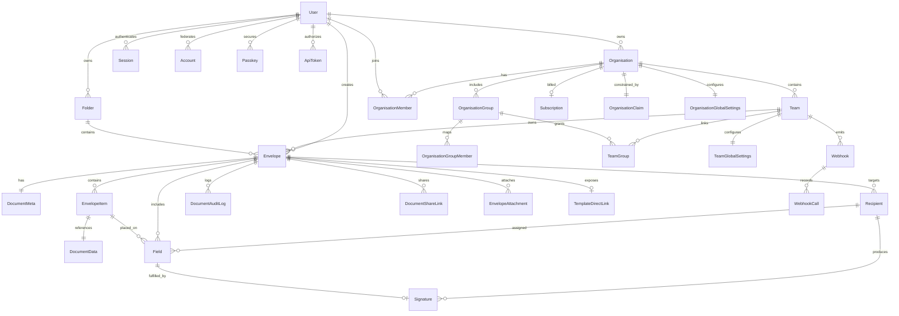

# Documenso Technical Documentation

## 1) Technical Overview

Documenso is a TypeScript monorepo for digital document signing. It combines a React Router (Remix-style) web app, Hono-based server routing, tRPC/REST APIs, and a PostgreSQL database via Prisma. The repository is designed to support cloud deployment and self-hosting while keeping business logic modular across packages.

Core technical characteristics:

- **Monorepo architecture** (npm workspaces + Turborepo).
- **Multi-API surface** (tRPC v2 + OpenAPI, ts-rest v1, internal tRPC).
- **Provider-driven infrastructure** (storage, email, jobs, signing providers selected by env).
- **Database-centric domain model** around envelope/document workflows, recipients, fields, and org/team RBAC.

---

## 2) Monorepo Structure

Root-level layout:

```text
documenso/
├── apps/
│   ├── remix/          # Main product app (UI + Hono server)
│   ├── docs/           # Documentation site
│   └── openpage-api/   # Public analytics/openpage API app
├── packages/
│   ├── api/            # REST API v1 (ts-rest)
│   ├── trpc/           # API v2 + internal tRPC + OpenAPI adapters
│   ├── lib/            # Core business logic and shared domain services
│   ├── prisma/         # Prisma schema, migrations, generated client setup
│   ├── auth/           # Authentication and session handling
│   ├── ui/             # Shared UI component library
│   ├── email/          # Email templates and transport abstractions
│   ├── signing/        # PDF signing providers
│   ├── ee/             # Enterprise-only features
│   └── ...             # Config/test/support packages
├── docker/             # Dev and production container definitions
├── ARCHITECTURE.md
└── package.json
```

---

## 3) Stack and Core Libraries

## 3.1 Application and Runtime

- TypeScript
- Node.js (v22+)
- npm workspaces
- Turborepo

## 3.2 Frontend

- React 18
- React Router (Remix-style app architecture)
- Tailwind CSS
- Radix UI primitives
- Shadcn-style component patterns
- React Hook Form + Zod resolvers
- Lingui (i18n)

## 3.3 Backend and APIs

- Hono (`apps/remix/server/router.ts` mounts app/API routes)
- tRPC (`packages/trpc`) for v2 APIs and internal procedures
- `trpc-to-openapi` for OpenAPI generation from tRPC procedures
- ts-rest (`packages/api/v1`) for contract-first REST v1 endpoints
- Zod + zod-openapi for request/response schema validation

## 3.4 Data Layer

- PostgreSQL
- Prisma ORM (`packages/prisma/schema.prisma`)
- Kysely integration for selected query patterns
- Prisma read-replica extension support

## 3.5 Auth and Security

- OAuth/OIDC via Arctic-based auth routes
- Passkeys/WebAuthn (`@simplewebauthn`)
- Session and token models persisted in database
- CSRF/session cookie handling in auth package

## 3.6 Async Processing, Email, and Storage

- Jobs provider abstraction: local DB-backed / BullMQ / Inngest
- Email provider abstraction: SMTP variants, Resend, MailChannels
- Storage abstraction: database transport or S3-compatible transport
- Signing abstraction: local certificate or Google Cloud HSM/KMS path

## 3.7 Observability and Tooling

- PostHog analytics (`posthog-js`, `posthog-node`)
- Pino logging
- ESLint + Prettier + Husky + commitlint
- Vitest and Playwright for test coverage layers

---

## 4) Frontend Design

The primary application frontend is in `apps/remix/app`.

- Route-driven architecture with segmented route groups:
  - authenticated routes,
  - unauthenticated/public routes,
  - recipient signing routes.
- Shared UI and design system components are pulled from `packages/ui`.
- Forms commonly combine React Hook Form + Zod for validation and type-safe parsing.
- i18n is implemented via Lingui, including macros in React/TypeScript code.
- Domain-level screens (documents, templates, organizations, settings) map to API procedures in `packages/trpc`.

Design principle: keep presentation in app routes/components while core business workflows and utilities live in reusable packages (`lib`, `trpc`, `auth`, `email`, `signing`).

---

## 5) Backend Design

## 5.1 Server Entry and Route Mounting

The Hono server in `apps/remix/server/router.ts` acts as the central router and mounts:

- `/api/v1/*` for ts-rest endpoints,
- `/api/v2/*` and `/api/v2-beta/*` for tRPC-openapi handlers,
- `/api/trpc/*` for internal tRPC,
- `/api/auth/*` for auth handlers,
- job endpoints and the web application routes.

## 5.2 API Layering Strategy

- **v1 (`packages/api/v1`)**: contract-first REST (deprecated/legacy compatibility).
- **v2 (`packages/trpc`)**: current API model using tRPC procedures with OpenAPI metadata.
- **internal tRPC**: frontend-to-backend communication for app internals.

This layered approach allows migration and compatibility while preserving typed contracts.

## 5.3 Domain Router Organization

The tRPC server is organized by domain routers (document/template/envelope/recipient/field/team/webhook, etc.), typically with paired type schemas for request/response contracts.

Benefits:

- clear domain ownership,
- independent route evolution,
- OpenAPI derivation from strongly-typed schemas.

## 5.4 Provider Pattern

Infrastructure choices are abstracted behind provider clients selected via environment variables:

- upload/storage transport,
- email transport,
- jobs provider,
- signing transport.

This makes the same business logic portable across cloud and self-hosted deployments.

---

## 6) Folder-by-Folder Guide (High Value Paths)

| Path | Purpose |
| --- | --- |
| `apps/remix/app/routes` | UI route modules and page composition |
| `apps/remix/server` | Hono server and API mounting |
| `packages/trpc/server` | v2 API procedures, routers, OpenAPI metadata |
| `packages/api/v1` | legacy v1 REST contracts and handlers |
| `packages/lib` | reusable domain/business logic and utilities |
| `packages/prisma` | schema, migrations, prisma client setup |
| `packages/auth/server` | auth routes, sessions, oauth/passkey logic |
| `packages/email` | email template rendering and transport integration |
| `packages/signing` | PDF signing implementations |
| `packages/ui` | shared UI component primitives and patterns |
| `packages/ee` | enterprise-only capabilities and feature flags |
| `apps/docs/content/docs` | product documentation source (MDX) |

---

## 7) Library Inventory by Responsibility

## 7.1 UI and Frontend Experience

- `react`, `react-dom`
- `react-router`, `@react-router/*`
- `@radix-ui/*`
- `tailwindcss`, `tailwind-merge`, `class-variance-authority`, `clsx`
- `lucide-react`
- `react-hook-form`, `@hookform/resolvers`

## 7.2 API and Validation

- `hono`, `@hono/node-server`, `@hono/trpc-server`
- `@trpc/client`, `@trpc/server`, `@trpc/react-query`
- `@ts-rest/core`, `@ts-rest/open-api`, `@ts-rest/serverless`
- `trpc-to-openapi`
- `zod`, `zod-openapi`, `zod-form-data`

## 7.3 Data and Persistence

- `prisma`, `@prisma/client`
- `prisma-extension-kysely`, `prisma-kysely`
- `kysely`, `pg`
- `@prisma/extension-read-replicas`

## 7.4 Auth and Security

- `arctic`, `oslo`, `jose`
- `@simplewebauthn/server`, `@simplewebauthn/browser`
- `@node-rs/bcrypt`
- crypto helpers from oslo/noble/scure packages

## 7.5 Jobs, Messaging, and Integrations

- `bullmq`, `@bull-board/*`, `inngest`
- `nodemailer`, `resend`, `@react-email/*`
- AWS SDK modules for S3/SES/CloudFront
- Google Cloud KMS/Secret Manager modules for signing/infrastructure use cases

## 7.6 Observability and Quality

- `posthog-js`, `posthog-node`
- `pino`, `pino-pretty`, `@datadog/pprof`
- `vitest`, `playwright`
- `eslint`, `prettier`, `husky`, `lint-staged`, `commitlint`

---

## 8) Database Design (Conceptual)

The data model has evolved toward an envelope-centric schema where both documents and templates are represented by `Envelope` plus related entities.

## 8.1 Core Domain Areas

1. **Identity and access**: users, accounts, sessions, passkeys, API tokens.
2. **Documents/signing**: envelopes, items, recipients, fields, signatures, audit logs.
3. **Collaboration and tenancy**: organizations, teams, memberships, groups.
4. **Commercial and governance**: subscriptions, org claims/settings.
5. **Operations and platform**: webhooks, webhook calls, background jobs, rate limits.

## 8.2 Key Relationship Summary

- A user can own/create many envelopes.
- Envelopes can belong to teams and optionally folders.
- An envelope contains items and recipients.
- Recipients have assigned fields and may produce signatures.
- Organizations contain teams, members, groups, and governance settings.
- Webhooks are scoped to team/user contexts and generate webhook call logs.

---

## 9) ERD (Mermaid)



---

## 10) API and Request Flow

High-level request path:

1. Browser request enters Hono server (`apps/remix/server`).
2. Route is dispatched to:
   - UI rendering path,
   - API v1 handler,
   - API v2/internal tRPC handler,
   - auth or jobs endpoint.
3. Domain logic executes in `packages/lib` and domain routers.
4. Persistence runs through Prisma/Kysely against PostgreSQL.
5. Async side effects (emails/webhooks/sealing) are queued through the jobs provider.

---

## 11) Environment-Driven Architecture

Important operational toggles include:

- upload transport (database vs S3),
- signing transport (local cert vs cloud HSM),
- SMTP transport choice,
- jobs provider (local/BullMQ/Inngest).

This abstraction is a key technical strength because it allows different deployment profiles without rewriting core product logic.

---

## 12) Testing and Quality Workflow

- **Unit/integration**: primarily Vitest in package-level modules.
- **End-to-end**: Playwright tests in `packages/app-tests`.
- **Static quality**: TypeScript checks, ESLint, Prettier, commit hooks.
- **Monorepo orchestration**: Turborepo pipelines and package-specific scripts.

Recommended onboarding sequence:

1. Run local dev stack (`npm run d` or manual setup).
2. Review `ARCHITECTURE.md` and `packages/prisma/schema.prisma`.
3. Trace one full workflow (upload -> send -> sign -> complete) across route, API, lib, and DB.
4. Run targeted tests before changing shared package logic.

---

## 13) Practical Notes for New Contributors

- Start with domain-scoped changes in one package/router path.
- Keep Zod schemas and OpenAPI metadata in sync when changing API contracts.
- Check feature gating boundaries (`packages/ee`) before exposing enterprise-only behavior.
- Consider provider compatibility for self-hosted environments (email/storage/jobs/signing).
- Verify migrations carefully when touching envelope/recipient/org models.

This repository is mature and modular; the fastest path to productive contributions is to anchor each change to one user workflow and trace it end-to-end through route -> API -> service -> schema.
