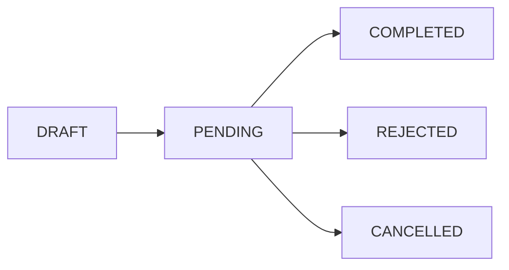

import { Callout } from 'fumadocs-ui/components/callout';
import { Tab, Tabs } from 'fumadocs-ui/components/tabs';

<EnvelopeWarning />

<Callout type="warn">
  This guide may not reflect the latest endpoints or parameters. For an always up-to-date reference,
  see the [OpenAPI Reference](https://openapi.documenso.com).
</Callout>

## Overview

[Documents](/docs/users/documents) (called "envelopes" in the API) are the core resource in Documenso. You can:

1. create documents with recipients and fields
2. send them for signing
3. track their status
4. retrieve the completed PDFs

Each document contains one or more PDF files, a list of recipients, and the fields they need to fill.

## Document Object

A document object contains the following properties:

| Property            | Type           | Description                                                                                  |
| ------------------- | -------------- | -------------------------------------------------------------------------------------------- |
| `id`                | string         | Unique identifier (e.g., `envelope_abc123`)                                                  |
| `secondaryId`       | string         | Legacy identifier in prefixed form (`document_123` for documents, `template_123` for templates) |
| `internalVersion`   | number         | Internal envelope schema version                                                             |
| `type`              | string         | `DOCUMENT` or `TEMPLATE`                                                                     |
| `status`            | string         | Current status: `DRAFT`, `PENDING`, `COMPLETED`, `REJECTED`, or `CANCELLED`                  |
| `title`             | string         | Document title                                                                               |
| `source`            | string         | How the document was created: `DOCUMENT`, `TEMPLATE`, `TEMPLATE_DIRECT_LINK`                 |
| `visibility`        | string         | Who can view: `EVERYONE`, `ADMIN`, `MANAGER_AND_ABOVE`                                       |
| `templateType`      | string         | Template visibility: `PUBLIC`, `PRIVATE`, or `ORGANISATION` (only meaningful for templates)  |
| `externalId`        | string \| null | Your custom identifier for the document                                                      |
| `userId`            | number         | ID of the user who owns the document                                                         |
| `teamId`            | number         | ID of the team the document belongs to                                                       |
| `folderId`          | string \| null | ID of the folder containing the document                                                     |
| `templateId`        | number \| null | Legacy ID of the template this document was created from                                     |
| `authOptions`       | object \| null | Access and action authentication requirements                                                |
| `formValues`        | object \| null | Pre-filled form values                                                                       |
| `publicTitle`       | string         | Public title shown on profile and direct-link pages                                          |
| `publicDescription` | string         | Public description shown on profile and direct-link pages                                    |
| `createdAt`         | string         | ISO 8601 timestamp                                                                           |
| `updatedAt`         | string         | ISO 8601 timestamp                                                                           |
| `completedAt`       | string \| null | Timestamp when all recipients completed signing                                              |
| `deletedAt`         | string \| null | Timestamp if soft-deleted                                                                    |
| `recipients`        | array          | List of recipients and their signing status                                                  |
| `fields`            | array          | Signature and form fields on the document                                                    |
| `envelopeItems`     | array          | PDF files attached to the document                                                           |
| `directLink`        | object \| null | Direct-link signing configuration (`id`, `token`, `enabled`, `directTemplateRecipientId`)    |
| `team`              | object         | Owning team (`id`, `url`)                                                                    |
| `user`              | object         | Document owner (`id`, `name`, `email`)                                                       |
| `documentMeta`      | object         | Email settings, redirect URL, signing options                                                |

Documents created through the API have `source: "DOCUMENT"` — there is no separate `API` source value. To tag documents created by your integration, set `externalId` when creating them.

### Example Document Object

```json
{
  "id": "envelope_abc123xyz",
  "secondaryId": "document_123",
  "internalVersion": 2,
  "type": "DOCUMENT",
  "status": "PENDING",
  "source": "DOCUMENT",
  "visibility": "EVERYONE",
  "templateType": "PRIVATE",
  "title": "Service Agreement",
  "externalId": "contract-2025-001",
  "userId": 1,
  "teamId": 1,
  "folderId": null,
  "templateId": null,
  "authOptions": null,
  "formValues": null,
  "publicTitle": "",
  "publicDescription": "",
  "createdAt": "2025-01-15T10:30:00.000Z",
  "updatedAt": "2025-01-15T10:35:00.000Z",
  "completedAt": null,
  "deletedAt": null,
  "recipients": [
    {
      "id": 1,
      "email": "signer@example.com",
      "name": "John Smith",
      "role": "SIGNER",
      "signingStatus": "NOT_SIGNED",
      "signingOrder": 1
    }
  ],
  "fields": [
    {
      "id": 123,
      "secondaryId": "field_abc123",
      "type": "SIGNATURE",
      "recipientId": 1,
      "envelopeId": "envelope_abc123xyz",
      "envelopeItemId": "envelope_item_xyz",
      "page": 1,
      "positionX": "10",
      "positionY": "80",
      "width": "30",
      "height": "5",
      "customText": "",
      "inserted": false,
      "fieldMeta": null
    }
  ],
  "envelopeItems": [
    {
      "id": "envelope_item_xyz",
      "envelopeId": "envelope_abc123xyz",
      "documentDataId": "doc_data_abc123",
      "title": "contract.pdf",
      "order": 1
    }
  ],
  "directLink": null,
  "team": {
    "id": 1,
    "url": "your-team"
  },
  "user": {
    "id": 1,
    "name": "Jane Smith",
    "email": "jane@example.com"
  },
  "documentMeta": {
    "subject": "Please sign this document",
    "message": "Hi, please review and sign this agreement.",
    "timezone": "America/New_York",
    "redirectUrl": "https://example.com/thank-you"
  }
}
```

Field position and size values are stored as decimals and serialized as strings in API responses.

## List Documents

Retrieve a paginated list of documents.

```
GET /envelope
```

### Query Parameters

| Parameter          | Type    | Description                                                   |
| ------------------ | ------- | ------------------------------------------------------------- |
| `page`             | integer | Page number (default: 1)                                      |
| `perPage`          | integer | Results per page (default: 10, max: 100)                      |
| `type`             | string  | Filter by `DOCUMENT` or `TEMPLATE`                            |
| `status`           | string  | Filter by status: `DRAFT`, `PENDING`, `COMPLETED`, `REJECTED`, `CANCELLED` |
| `source`           | string  | Filter by creation source                                     |
| `folderId`         | string  | Filter by folder ID                                           |
| `orderByColumn`    | string  | Sort field (only `createdAt` supported)                       |
| `orderByDirection` | string  | Sort direction: `asc` or `desc` (default: `desc`)             |

### Code Examples

<Tabs items={['curl', 'TypeScript']}>
<Tab value="curl">
```bash
# List all documents
curl -X GET "https://app.documenso.com/api/v2/envelope" \
  -H "Authorization: api_xxxxxxxxxxxxxxxx"

# Filter by status and paginate

curl -X GET "https://app.documenso.com/api/v2/envelope?status=PENDING&page=1&perPage=20" \
 -H "Authorization: api_xxxxxxxxxxxxxxxx"

# List only documents (not templates)

curl -X GET "https://app.documenso.com/api/v2/envelope?type=DOCUMENT" \
 -H "Authorization: api_xxxxxxxxxxxxxxxx"

````
</Tab>
<Tab value="TypeScript">
```typescript
const API_TOKEN = process.env.DOCUMENSO_API_TOKEN;
const BASE_URL = 'https://app.documenso.com/api/v2';

// List all documents
const response = await fetch(`${BASE_URL}/envelope`, {
  method: 'GET',
  headers: {
    Authorization: API_TOKEN,
  },
});

const { data, count } = await response.json();
console.log(`Found ${count} documents`);

// Filter by status
const pendingResponse = await fetch(
  `${BASE_URL}/envelope?status=PENDING&page=1&perPage=20`,
  {
    method: 'GET',
    headers: {
      Authorization: API_TOKEN,
    },
  }
);

const pendingDocs = await pendingResponse.json();
````

</Tab>
</Tabs>

### Response

```json
{
  "data": [
    {
      "id": "envelope_abc123",
      "type": "DOCUMENT",
      "status": "PENDING",
      "title": "Service Agreement",
      "createdAt": "2025-01-15T10:30:00.000Z",
      "updatedAt": "2025-01-15T10:35:00.000Z",
      "recipients": [
        {
          "id": 1,
          "email": "signer@example.com",
          "name": "John Smith",
          "role": "SIGNER",
          "signingStatus": "NOT_SIGNED"
        }
      ]
    }
  ],
  "count": 42,
  "currentPage": 1,
  "perPage": 10,
  "totalPages": 5
}
```

---

## Get Document

Retrieve a single document by ID.

```
GET /envelope/{envelopeId}
```

### Path Parameters

| Parameter    | Type   | Description                               |
| ------------ | ------ | ----------------------------------------- |
| `envelopeId` | string | The document ID (e.g., `envelope_abc123`) |

### Code Examples

<Tabs items={['curl', 'TypeScript']}>
<Tab value="curl">
```bash
curl -X GET "https://app.documenso.com/api/v2/envelope/envelope_abc123" \
  -H "Authorization: api_xxxxxxxxxxxxxxxx"
```
</Tab>
<Tab value="TypeScript">
```typescript
const envelopeId = 'envelope_abc123';

const response = await fetch(`https://app.documenso.com/api/v2/envelope/${envelopeId}`, {
  method: 'GET',
  headers: {
    Authorization: 'api_xxxxxxxxxxxxxxxx',
  },
});

const document = await response.json();
console.log(document.title, document.status);
````
</Tab>
</Tabs>

### Response

Returns the full document object including recipients, fields, and envelope items.

```json
{
  "id": "envelope_abc123",
  "type": "DOCUMENT",
  "status": "PENDING",
  "title": "Service Agreement",
  "recipients": [...],
  "fields": [...],
  "envelopeItems": [...],
  "documentMeta": {...}
}
````

---

## Create Document

Create a new document with optional recipients and fields in a single request.

<Callout type="info">
  This endpoint automatically scans uploaded PDFs for [placeholder patterns](/docs/users/documents/advanced/pdf-placeholders) like `{"{{signature, r1}}"}` and creates fields at those locations.
</Callout>

```
POST /envelope/create
Content-Type: multipart/form-data
```

### Request Body

The request uses `multipart/form-data` with two parts:

| Part      | Type    | Description            |
| --------- | ------- | ---------------------- |
| `payload` | JSON    | Document configuration |
| `files`   | File(s) | One or more PDF files  |

### Payload Schema

| Field        | Type   | Required | Description                                 |
| ------------ | ------ | -------- | ------------------------------------------- |
| `type`       | string | Yes      | Must be `DOCUMENT`                          |
| `title`      | string | Yes      | Document title                              |
| `externalId` | string | No       | Your custom identifier                      |
| `visibility` | string | No       | `EVERYONE`, `ADMIN`, or `MANAGER_AND_ABOVE` |
| `folderId`   | string | No       | Folder ID to create the document in         |
| `recipients` | array  | No       | Recipients with optional fields             |
| `meta`       | object | No       | Email subject, message, redirect URL, etc.  |

### Code Examples

<Tabs items={['curl', 'TypeScript']}>
<Tab value="curl">
```bash
curl -X POST "https://app.documenso.com/api/v2/envelope/create" \
  -H "Authorization: api_xxxxxxxxxxxxxxxx" \
  -H "Content-Type: multipart/form-data" \
  -F 'payload={
    "type": "DOCUMENT",
    "title": "Service Agreement",
    "externalId": "contract-2025-001",
    "recipients": [
      {
        "email": "signer@example.com",
        "name": "John Smith",
        "role": "SIGNER",
        "fields": [
          {
            "identifier": 0,
            "type": "SIGNATURE",
            "page": 1,
            "positionX": 10,
            "positionY": 80,
            "width": 30,
            "height": 5
          },
          {
            "identifier": 0,
            "type": "DATE",
            "page": 1,
            "positionX": 50,
            "positionY": 80,
            "width": 20,
            "height": 3
          }
        ]
      }
    ],
    "meta": {
      "subject": "Please sign this agreement",
      "message": "Hi John, please review and sign the attached agreement.",
      "redirectUrl": "https://example.com/thank-you"
    }
  }' \
  -F "files=@./contract.pdf;type=application/pdf"
```
</Tab>
<Tab value="TypeScript">
```typescript
import fs from 'fs';
import FormData from 'form-data';

const form = new FormData();

const payload = {
  type: 'DOCUMENT',
  title: 'Service Agreement',
  externalId: 'contract-2025-001',
  recipients: [
    {
      email: 'signer@example.com',
      name: 'John Smith',
      role: 'SIGNER',
      fields: [
        {
          identifier: 0,
          type: 'SIGNATURE',
          page: 1,
          positionX: 10,
          positionY: 80,
          width: 30,
          height: 5,
        },
        {
          identifier: 0,
          type: 'DATE',
          page: 1,
          positionX: 50,
          positionY: 80,
          width: 20,
          height: 3,
        },
      ],
    },
  ],
  meta: {
    subject: 'Please sign this agreement',
    message: 'Hi John, please review and sign the attached agreement.',
    redirectUrl: 'https://example.com/thank-you',
  },
};

form.append('payload', JSON.stringify(payload));
form.append('files', fs.createReadStream('./contract.pdf'), {
  contentType: 'application/pdf',
});

const response = await fetch('https://app.documenso.com/api/v2/envelope/create', {
  method: 'POST',
  headers: {
    Authorization: 'api_xxxxxxxxxxxxxxxx',
  },
  body: form,
});

const { id } = await response.json();
console.log('Created document:', id);
````
</Tab>
</Tabs>

### Response

```json
{
  "id": "envelope_abc123xyz"
}
````

### Field Positioning

Field positions use percentage values (0-100) relative to the PDF page:

| Parameter    | Description                                                |
| ------------ | ---------------------------------------------------------- |
| `positionX`  | Horizontal position from left edge (0 = left, 100 = right) |
| `positionY`  | Vertical position from top edge (0 = top, 100 = bottom)    |
| `width`      | Field width as percentage of page width                    |
| `height`     | Field height as percentage of page height                  |
| `page`       | Page number (1-indexed)                                    |
| `identifier` | File index (0 for first file) or filename                  |

### Field Types

| Type        | Description                 |
| ----------- | --------------------------- |
| `SIGNATURE` | Signature field             |
| `INITIALS`  | Initials field              |
| `NAME`      | Auto-filled recipient name  |
| `EMAIL`     | Auto-filled recipient email |
| `DATE`      | Signing date                |
| `TEXT`      | Free text input             |
| `NUMBER`    | Numeric input               |
| `CHECKBOX`  | Checkbox selection          |
| `RADIO`     | Radio button group          |
| `DROPDOWN`  | Dropdown selection          |

### Recipient Roles

| Role       | Description                               |
| ---------- | ----------------------------------------- |
| `SIGNER`   | Must sign the document                    |
| `APPROVER` | Must approve before signers can sign      |
| `CC`       | Receives a copy but doesn't sign          |
| `VIEWER`   | Can view the document but takes no action |

---

## Update Document

Update a document's properties. Only works on documents in `DRAFT` status.

```
POST /envelope/update
```

### Request Body

| Field        | Type   | Required | Description                          |
| ------------ | ------ | -------- | ------------------------------------ |
| `envelopeId` | string | Yes      | Document ID                          |
| `data`       | object | No       | Document properties to update        |
| `meta`       | object | No       | Email and signing settings to update |

### Code Examples

<Tabs items={['curl', 'TypeScript']}>
<Tab value="curl">
```bash
curl -X POST "https://app.documenso.com/api/v2/envelope/update" \
  -H "Authorization: api_xxxxxxxxxxxxxxxx" \
  -H "Content-Type: application/json" \
  -d '{
    "envelopeId": "envelope_abc123",
    "data": {
      "title": "Updated Service Agreement",
      "externalId": "contract-2025-001-v2"
    },
    "meta": {
      "subject": "Updated: Please sign this agreement",
      "redirectUrl": "https://example.com/signed"
    }
  }'
```
</Tab>
<Tab value="TypeScript">
```typescript
const response = await fetch('https://app.documenso.com/api/v2/envelope/update', {
  method: 'POST',
  headers: {
    Authorization: 'api_xxxxxxxxxxxxxxxx',
    'Content-Type': 'application/json',
  },
  body: JSON.stringify({
    envelopeId: 'envelope_abc123',
    data: {
      title: 'Updated Service Agreement',
      externalId: 'contract-2025-001-v2',
    },
    meta: {
      subject: 'Updated: Please sign this agreement',
      redirectUrl: 'https://example.com/signed',
    },
  }),
});

const document = await response.json();

```
</Tab>
</Tabs>

---

## Send Document

Send a document to recipients for signing. This changes the status from `DRAFT` to `PENDING`.

```

POST /envelope/distribute

````

### Request Body

| Field | Type | Required | Description |
| --- | --- | --- | --- |
| `envelopeId` | string | Yes | Document ID |
| `meta` | object | No | Override email settings for this send |

### Code Examples

<Tabs items={['curl', 'TypeScript']}>
<Tab value="curl">
```bash
# Basic send
curl -X POST "https://app.documenso.com/api/v2/envelope/distribute" \
  -H "Authorization: api_xxxxxxxxxxxxxxxx" \
  -H "Content-Type: application/json" \
  -d '{
    "envelopeId": "envelope_abc123"
  }'

# Send with custom email settings
curl -X POST "https://app.documenso.com/api/v2/envelope/distribute" \
  -H "Authorization: api_xxxxxxxxxxxxxxxx" \
  -H "Content-Type: application/json" \
  -d '{
    "envelopeId": "envelope_abc123",
    "meta": {
      "subject": "Action Required: Sign Agreement",
      "message": "Please sign this document by end of day.",
      "timezone": "America/New_York"
    }
  }'
````

</Tab>
<Tab value="TypeScript">
```typescript
const response = await fetch('https://app.documenso.com/api/v2/envelope/distribute', {
  method: 'POST',
  headers: {
    Authorization: 'api_xxxxxxxxxxxxxxxx',
    'Content-Type': 'application/json',
  },
  body: JSON.stringify({
    envelopeId: 'envelope_abc123',
    meta: {
      subject: 'Action Required: Sign Agreement',
      message: 'Please sign this document by end of day.',
    },
  }),
});

const { id, recipients } = await response.json();

// Recipients now include signing URLs
recipients.forEach((r) => {
  console.log(`${r.email}: ${r.signingUrl}`);
});

````
</Tab>
</Tabs>

### Response

The response includes signing URLs for each recipient:

```json
{
  "success": true,
  "id": "envelope_abc123",
  "recipients": [
    {
      "id": 1,
      "name": "John Smith",
      "email": "signer@example.com",
      "token": "abc123xyz",
      "role": "SIGNER",
      "signingOrder": 1,
      "signingUrl": "https://app.documenso.com/sign/abc123xyz"
    }
  ]
}
````

<Callout type="info">
  Use the `signingUrl` to redirect recipients directly to the signing page, or let them use the
  email link.
</Callout>

---

## Cancel Document

Cancel a pending document. This changes its status from `PENDING` to `CANCELLED`.

```
POST /envelope/cancel
```

### Request Body

| Field        | Type   | Required | Description                         |
| ------------ | ------ | -------- | ----------------------------------- |
| `envelopeId` | string | Yes      | Document ID                         |
| `reason`     | string | No       | Reason for cancelling the document |

### Code Examples

<Tabs items={['curl', 'TypeScript']}>
<Tab value="curl">
```bash
curl -X POST "https://app.documenso.com/api/v2/envelope/cancel" \
  -H "Authorization: api_xxxxxxxxxxxxxxxx" \
  -H "Content-Type: application/json" \
  -d '{
    "envelopeId": "envelope_abc123",
    "reason": "The agreement is no longer needed."
  }'
```
</Tab>
<Tab value="TypeScript">
```typescript
const response = await fetch('https://app.documenso.com/api/v2/envelope/cancel', {
  method: 'POST',
  headers: {
    Authorization: 'api_xxxxxxxxxxxxxxxx',
    'Content-Type': 'application/json',
  },
  body: JSON.stringify({
    envelopeId: 'envelope_abc123',
    reason: 'The agreement is no longer needed.',
  }),
});

const { success } = await response.json();
```
</Tab>
</Tabs>

### Response

```json
{
  "success": true
}
```

### Behavior

- Only documents in `PENDING` status can be cancelled. Other statuses return `400`.
- Cancellation is not idempotent. Cancelling the same document again returns `400`.
- The document owner and team members with `MANAGER` or higher permissions can cancel it. Requests for documents you cannot view return `404`; requests for visible documents without sufficient permissions return `401`.
- A successful cancellation fires the `DOCUMENT_CANCELLED` webhook.
- Cancellation emails are sent only to eligible non-CC, non-rejected recipients who were sent or opened the document.

---

## Delete Document

Delete a document. Completed documents cannot be deleted.

```
POST /envelope/delete
```

### Request Body

| Field        | Type   | Required | Description |
| ------------ | ------ | -------- | ----------- |
| `envelopeId` | string | Yes      | Document ID |

### Code Examples

<Tabs items={['curl', 'TypeScript']}>
<Tab value="curl">
```bash
curl -X POST "https://app.documenso.com/api/v2/envelope/delete" \
  -H "Authorization: api_xxxxxxxxxxxxxxxx" \
  -H "Content-Type: application/json" \
  -d '{
    "envelopeId": "envelope_abc123"
  }'
```
</Tab>
<Tab value="TypeScript">
```typescript
const response = await fetch('https://app.documenso.com/api/v2/envelope/delete', {
  method: 'POST',
  headers: {
    Authorization: 'api_xxxxxxxxxxxxxxxx',
    'Content-Type': 'application/json',
  },
  body: JSON.stringify({
    envelopeId: 'envelope_abc123',
  }),
});

const { success } = await response.json();

```
</Tab>
</Tabs>

### Response

```json
{
  "success": true
}
```

---

## Get Multiple Documents

Retrieve multiple documents by their IDs in a single request.

```
POST /envelope/get-many
```

### Request Body

| Field      | Type   | Required | Description                                                                  |
| ---------- | ------ | -------- | ---------------------------------------------------------------------------- |
| `ids`      | object | Yes      | ID selector containing `type` and `ids`                                      |
| `ids.type` | string | Yes      | `envelopeId`, `documentId`, or `templateId`                                  |
| `ids.ids`  | array  | Yes      | 1-20 IDs: strings for `envelopeId`; numbers for `documentId` or `templateId` |

### Code Examples

<Tabs items={['curl', 'TypeScript']}>
<Tab value="curl">
```bash
curl -X POST "https://app.documenso.com/api/v2/envelope/get-many" \
  -H "Authorization: api_xxxxxxxxxxxxxxxx" \
  -H "Content-Type: application/json" \
  -d '{
    "ids": {
      "type": "envelopeId",
      "ids": ["envelope_abc123", "envelope_def456", "envelope_ghi789"]
    }
  }'
```
</Tab>
<Tab value="TypeScript">
```typescript
const requestedIds = ['envelope_abc123', 'envelope_def456', 'envelope_ghi789'];

const response = await fetch('https://app.documenso.com/api/v2/envelope/get-many', {
  method: 'POST',
  headers: {
    Authorization: 'api_xxxxxxxxxxxxxxxx',
    'Content-Type': 'application/json',
  },
  body: JSON.stringify({
    ids: {
      type: 'envelopeId',
      ids: requestedIds,
    },
  }),
});

const { data } = await response.json();

```
</Tab>
</Tabs>

### Response

```json
{
  "data": [
    {
      "id": "envelope_abc123",
      "type": "DOCUMENT",
      "status": "PENDING",
      "title": "Service Agreement"
    }
  ]
}
```

The endpoint silently omits envelopes you cannot access instead of returning `404`. Compare `data.length` with `requestedIds.length` to detect omissions.

---

## Document Statuses

| Status | Description |
| --- | --- |
| `DRAFT` | Document is being prepared. Recipients have not been notified. |
| `PENDING` | Document has been sent. Waiting for recipients to sign. |
| `COMPLETED` | All recipients have signed. Document is sealed. |
| `REJECTED` | A recipient rejected the document. |
| `CANCELLED` | The document was cancelled by its owner or a team member with `MANAGER` or higher permissions. |

### Status Transitions



- **DRAFT to PENDING**: Call the distribute endpoint
- **PENDING to COMPLETED**: All recipients complete their signing
- **PENDING to REJECTED**: A recipient rejects the document
- **PENDING to CANCELLED**: The document owner or a team member with `MANAGER` or higher permissions cancels the document

<Callout type="warn">
  You cannot modify recipients or fields after a document moves to `PENDING` status.
</Callout>

---

## Filtering and Pagination

### Pagination Parameters

| Parameter | Type    | Default | Description                 |
| --------- | ------- | ------- | --------------------------- |
| `page`    | integer | 1       | Page number                 |
| `perPage` | integer | 10      | Results per page (max: 100) |

### Filter Parameters

| Parameter  | Values                                      | Description               |
| ---------- | ------------------------------------------- | ------------------------- |
| `type`     | `DOCUMENT`, `TEMPLATE`                      | Filter by envelope type   |
| `status`   | `DRAFT`, `PENDING`, `COMPLETED`, `REJECTED`, `CANCELLED` | Filter by status          |
| `source`   | `DOCUMENT`, `TEMPLATE`, `TEMPLATE_DIRECT_LINK`          | Filter by creation source |
| `folderId` | string                                      | Filter by folder          |

### Sorting

| Parameter          | Values        | Description                      |
| ------------------ | ------------- | -------------------------------- |
| `orderByColumn`    | `createdAt`   | Field to sort by                 |
| `orderByDirection` | `asc`, `desc` | Sort direction (default: `desc`) |

### Example: Fetch All Pending Documents

```typescript
async function getAllPendingDocuments() {
  const documents = [];
  let page = 1;
  let hasMore = true;

  while (hasMore) {
    const response = await fetch(
      `https://app.documenso.com/api/v2/envelope?status=PENDING&page=${page}&perPage=100`,
      {
        headers: { Authorization: 'api_xxxxxxxxxxxxxxxx' },
      },
    );

    const { data, currentPage, totalPages } = await response.json();
    documents.push(...data);

    hasMore = currentPage < totalPages;
    page++;
  }

  return documents;
}
```

---

## See Also

- [Recipients API](/docs/developers/api/recipients) - Add and manage document recipients
- [Fields API](/docs/developers/api/fields) - Add signature and form fields
- [Templates API](/docs/developers/api/templates) - Create reusable document templates
- [Webhooks](/docs/developers/webhooks) - Get notified when documents are signed
