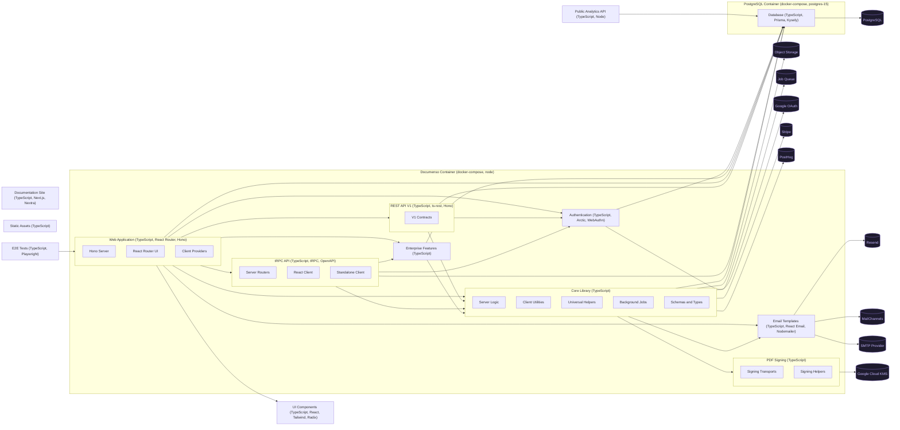
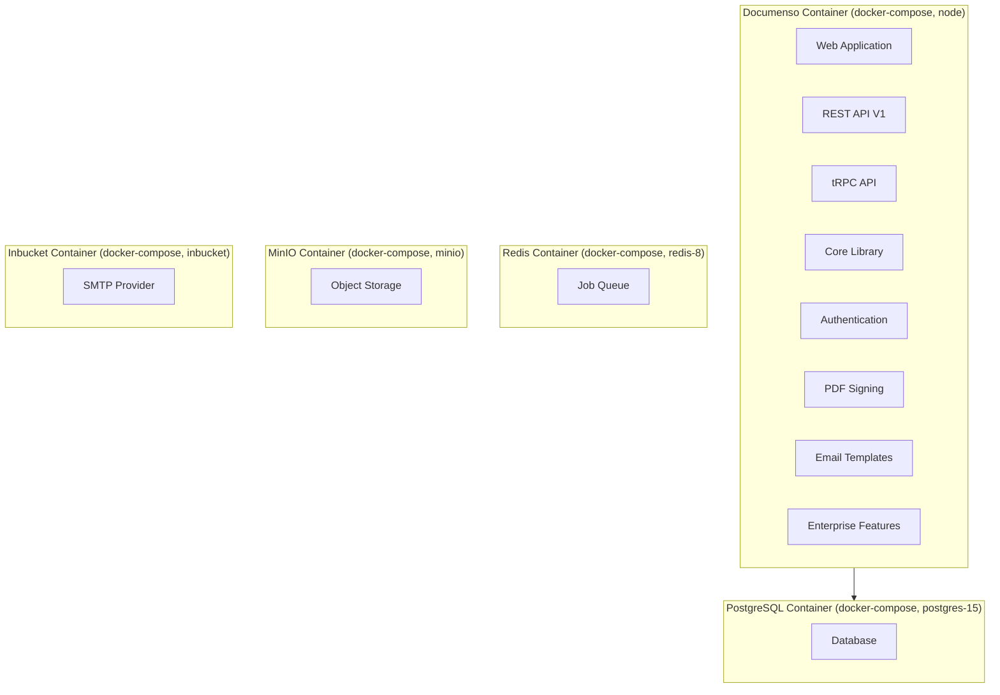

# Architecture

---

### Web Application `TypeScript, React Router, Hono`

Main user-facing web app and HTTP server that mounts every API surface and serves the React UI.

**Path:** `apps/remix`

**Depends on:** REST API V1, tRPC API, Core Library, UI Components, Authentication, Email Templates, Database, Enterprise Features

- **Hono Server** — Hono entry point that wires routing, middleware, and mounts api/trpc/jobs handlers.
- **React Router UI** — File-based React Router routes for authenticated, public, and recipient-signing pages.
- **Client Providers** — Top-level React providers for auth, theming, i18n, and tRPC client wiring.

### Documentation Site `TypeScript, Next.js, Nextra`

Standalone documentation portal for product and developer guides.

**Path:** `apps/docs`

### Public Analytics API `TypeScript, Node`

Publicly exposed API that serves aggregate analytics for the openpage marketing surface.

**Path:** `apps/openpage-api`

**Depends on:** Database

### REST API V1 `TypeScript, ts-rest, Hono`

Deprecated but maintained REST API for documents, templates, recipients, and fields under /api/v1.

**Path:** `packages/api`

**Depends on:** Core Library, Database, Authentication

- **V1 Contracts** — ts-rest contract definitions, handlers, and Zod schemas for the legacy REST surface.

### tRPC API `TypeScript, tRPC, OpenAPI`

Internal tRPC API and public V2 OpenAPI surface covering documents, templates, envelopes, folders, and admin.

**Path:** `packages/trpc`

**Depends on:** Core Library, Database, Authentication, Enterprise Features

- **Server Routers** — Domain routers (document, template, envelope, recipient, field, etc.) exposed via tRPC and OpenAPI.
- **React Client** — React Query bindings used by the frontend to consume internal tRPC procedures.
- **Standalone Client** — Plain tRPC client for non-React consumers and server-to-server calls.

### Core Library `TypeScript`

Shared business logic, background jobs, schemas, and provider strategies used by every server surface.

**Path:** `packages/lib`

**Depends on:** Database, Email Templates, PDF Signing, Object Storage, Job Queue, Stripe, PostHog

- **Server Logic** — Server-only domain functions for documents, recipients, billing, webhooks, and admin actions.
- **Client Utilities** — Browser-safe helpers, hooks, and constants consumed by the React UI.
- **Universal Helpers** — Isomorphic utilities including upload abstractions, validation, and crypto-safe helpers.
- **Background Jobs** — Job definitions and pluggable provider clients for Local, BullMQ, and Inngest queues.
- **Schemas and Types** — Shared Zod schemas and TypeScript types reused across API and UI layers.

### Database `TypeScript, Prisma, Kysely`

Prisma schema, generated client, migrations, and Kysely query builder for PostgreSQL access.

**Path:** `packages/prisma`

**Depends on:** PostgreSQL

### UI Components `TypeScript, React, Tailwind, Radix`

Shared component library built on Shadcn and Radix primitives styled with Tailwind.

**Path:** `packages/ui`

### Email Templates `TypeScript, React Email, Nodemailer`

React Email templates and the swappable mailer that dispatches via SMTP, Resend, or MailChannels.

**Path:** `packages/email`

**Depends on:** Resend, MailChannels, SMTP Provider

### Authentication `TypeScript, Arctic, WebAuthn`

Session, OAuth (Arctic), and passkey/WebAuthn authentication flows shared across server entry points.

**Path:** `packages/auth`

**Depends on:** Database, Google OAuth

### PDF Signing `TypeScript`

Cryptographic PDF signing with swappable Local P12 and Google Cloud HSM transports.

**Path:** `packages/signing`

**Depends on:** Google Cloud KMS

- **Signing Transports** — Provider implementations for local P12 certificates and Google Cloud HSM-backed signing.
- **Signing Helpers** — PDF preparation utilities, timestamp authority calls, and signature placement helpers.

### Enterprise Features `TypeScript`

Server-only Enterprise Edition features layered on top of the core platform under a separate license.

**Path:** `packages/ee`

**Depends on:** Core Library, Database

### Static Assets `TypeScript`

Shared static images, fonts, and brand assets bundled into apps and emails.

**Path:** `packages/assets`

### E2E Tests `TypeScript, Playwright`

Playwright end-to-end test suite that exercises the running web application.

**Path:** `packages/app-tests`

**Depends on:** Web Application

---

## Deployment

**Documenso Container** `docker-compose, node`
: Single Node container running the Remix/Hono app image that serves UI, APIs, and job handlers.
  Hosts: Web Application, REST API V1, tRPC API, Core Library, Authentication, PDF Signing, Email Templates, Enterprise Features
  Depends on: PostgreSQL Container

**PostgreSQL Container** `docker-compose, postgres-15`
: Postgres 15 container with a persistent volume that backs the Documenso database.
  Hosts: Database

**Redis Container** `docker-compose, redis-8`
: Development Redis instance available to back the BullMQ jobs provider and caching needs.
  Hosts: Job Queue

**MinIO Container** `docker-compose, minio`
: Development S3-compatible object store used when NEXT_PUBLIC_UPLOAD_TRANSPORT is set to s3.
  Hosts: Object Storage

**Inbucket Container** `docker-compose, inbucket`
: Development SMTP/IMAP catcher that captures outbound mail for local testing.
  Hosts: SMTP Provider
